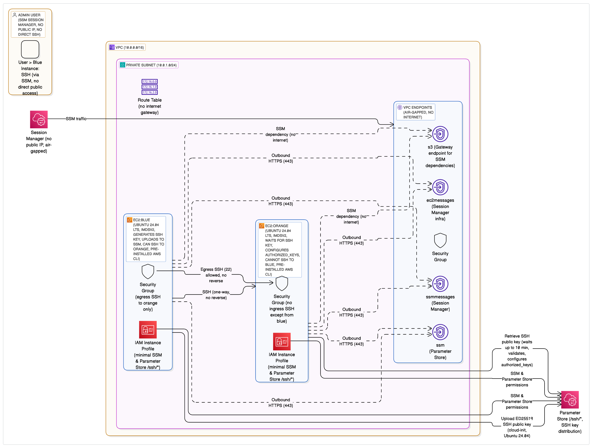

# Blue-Orange EC2 Infrastructure

A Terraform infrastructure that provisions two EC2 instances with asymmetric SSH connectivity in AWS.

## Architecture

This infrastructure creates a secure blue-orange deployment environment with the following components:

**Network Infrastructure:**
- Custom VPC (10.0.0.0/16) in a single availability zone
- Single private subnet (10.0.1.0/24) containing both EC2 instances
- **No internet connectivity** - fully air-gapped environment
- VPC endpoints for AWS service access (SSM, SSM Messages, EC2 Messages, S3)

**Compute Resources:**
- Two EC2 instances running Ubuntu 24.04 LTS:
  - `blue`: Can initiate SSH connections to orange
  - `orange`: Cannot SSH back to blue (asymmetric access)
- Both instances have private IPs only, no public IP addresses

**Security Controls:**
- Security groups enforcing unidirectional SSH access (blue → orange only)
- IAM roles with minimal SSM permissions for Parameter Store access
- IMDSv2 enforced for enhanced metadata security
- SSH key pair automatically generated and distributed via SSM Parameter Store

**AWS Service Access:**
- Administrative access via AWS Systems Manager Session Manager only
- VPC endpoints provide secure access to AWS services:
  - **SSM**: Parameter Store operations
  - **SSM Messages**: Session Manager connectivity
  - **EC2 Messages**: Session Manager requirements
  - **S3 Gateway**: SSM service dependencies

The architecture ensures instances remain completely isolated from the internet while providing secure management capabilities and controlled network access patterns suitable for blue-green deployment scenarios.



## Testing Notes & Known Issues

⚠️ **Disclaimer**: This infrastructure was tested on **Linux ARM64** architecture. While the Terraform configuration is platform-agnostic, testing was conducted specifically on ARM64 systems.

**Known Issues:**
- In rare conditions during testing, VMs may enter a faulty state that requires redeployment
- These intermittent issues appear to be related to cloud-init timing or AWS service initialization
- Further investigation of these edge cases would require more than the 2 hours prescribed for this assignment
- If you encounter deployment issues, try running `terraform destroy` followed by `terraform apply` again

## SSH Key Setup Implementation

The infrastructure implements an optimized SSH key distribution mechanism leveraging Ubuntu 24.04's built-in `ssm-user` creation:

1. **Key Generation**: Blue instance generates an ED25519 SSH key pair during cloud-init
2. **Key Distribution**: Public key is uploaded to AWS Systems Manager Parameter Store
3. **Automatic ssm-user**: Ubuntu 24.04 creates `ssm-user` automatically (no manual triggering needed)
4. **Key Deployment**: SSH keys are copied to both `ubuntu` and `ssm-user` accounts
5. **Orange Setup**: Orange instance waits for and validates the SSH key from Parameter Store
6. **Robust Validation**: Orange verifies it receives a real SSH key (not placeholder values)

## Configuration Variables

The following variables can be customized in `terraform.tfvars` or via command line:

| Variable | Type | Default | Description |
|----------|------|---------|-------------|
| `aws_region` | string | `us-east-1` | AWS region where resources will be deployed |
| `aws_vpc_name` | string | `takehome-vpc` | Name of the VPC to create |
| `aws_ec2_instances` | map | See below | Configuration for both EC2 instances |
| `aws_ami` | string | `ami-055c4ffce961ad000` | AMI of Ubuntu 24.04 |

### Instance Configuration

The `aws_ec2_instances` variable allows customization of both instances:

```hcl
aws_ec2_instances = {
  "blue" = {
    name = "blue"       # Instance name tag
    type = "t2.micro"   # Instance type
  },
  "orange" = {
    name = "orange"     # Instance name tag  
    type = "t2.micro"   # Instance type
  }
}
```

### Example terraform.tfvars

```hcl
aws_region = "us-west-2"
aws_vpc_name = "my-custom-vpc"
aws_ec2_instances = {
  "blue" = {
    name = "blue-server"
    type = "t3.small"
  },
  "orange" = {
    name = "orange-server"
    type = "t3.small"
  }
}
aws_ami = "some-ami"
```

## Deployment

### Prerequisites
- Terraform >= 1.0
- AWS CLI configured with appropriate permissions
- Python >= 3.8 (for testing)

### Deploy Infrastructure

```bash
# Configure AWS credentials (recommended)
aws configure

# OR use profile
export AWS_PROFILE=some-profile

# OR use environment variables (not recommended)
export AWS_ACCESS_KEY_ID=...
export AWS_SECRET_ACCESS_KEY=...

# Navigate to terraform directory
cd terraform/

# Initialize and deploy
terraform init
terraform plan
terraform apply
```

## Testing

### Automated Testing

The infrastructure includes a Python test suite that verifies connectivity and security requirements:

```bash
# Set up test environment
cd test/
./setup.sh
source activate.sh

# Configure AWS credentials (same as deployment)
export AWS_REGION=us-east-1  # Match your deployment region
aws configure  # or use profile/environment variables

# Run tests
python test_infrastructure.py
```

**Timing Considerations:**
- Tests typically pass within 1-2 minutes after deployment
- If tests fail initially, wait a minute and retry

The test verifies:
1. PASS: Blue instance can SSH to orange instance
2. FAIL: Orange instance cannot SSH to blue instance (expected failure)

### Manual Testing

If automated tests fail, you can verify functionality manually via AWS Session Manager:

1. **Connect to blue instance**: Use AWS Console → EC2 → Session Manager → Start Session
2. **Test SSH connectivity**: Run `ssh ubuntu@<orange_private_ip>` from blue instance
3. **Verify asymmetric access**: Confirm orange cannot SSH back to blue

To check cloud-init status on an instance:
```bash
# Connect via Session Manager, then run:
sudo cloud-init status --wait
sudo tail -f /var/log/cloud-init-output.log
```

### Cleanup
```bash
# From terraform directory
terraform destroy
```